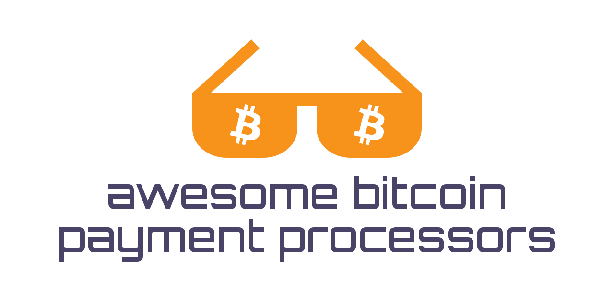

# Awesome Bitcoin Payment Processors 

A list of awesome Bitcoin payment processors and stories from merchants using them. Why are they awesome?

1. They are either protected against financial censorship or they don't practice it.
2. They process native Bitcoin transactions and don't require wallets to use the [controversial payment protocol](https://blog.samouraiwallet.com/post/169222582782/bitpay-qr-codes-are-no-longer-valid-important).
3. They don't [block payments by IPs/locations](https://twitter.com/alex_kaul/status/1090211252331208705).

## Contents

- [Self-Hosted Payment Processors](#self-hosted-payment-processors)
- [Hosted Payment Processors](#hosted-payment-processors)
- [Merchant Stories](#merchant-stories)

## Self-Hosted Payment Processors

Self-Hosted payment processors run on your server and provide you with a full control over the entire payment process and funds. There's no third-party involvement - that significantly increases the censorship-resistance, privacy, and security for you and your customers. 

| Processor | Fees | Lightning | Directly to Your Wallet | Conversion to Fiat | Requirements |
| --------- |:----:|:---------:|:-----------------------:|:------------------:| ------------ |
| [BTCPay Server](https://btcpayserver.org/) | No fees | Yes | Yes | Via [Payment Forwarding](https://www.blockonomics.co/views/payment_forwarding.html) and [Exchange Integration](https://redbtc.org/flows/integrations/kraken-exchange/) | 2 GB RAM, 80 GB Storage, Docker |
| [One Time Address](https://github.com/alexk111/One-Time-Address) | No fees | No | Yes | No | NodeJS |
| [CryptoWoo](https://www.cryptowoo.com/) | $34 - $99 per year | No | Yes | No | PHP 5.6+, Wordpress 4.3+, WooCommerce 3.0+ |
| [BitcartCC](https://bitcartcc.com) | No fees | Yes | Yes | No | 1 GB RAM, 10 GB Storage, Docker |
| [LnMe](https://github.com/bumi/lnme) | No fees | Yes | Yes | No | LND node |

## Hosted Payment Processors

Hosted payment processors run on someone else's server. This simplifies the initial setup process, but reduces the amount of control you have over the payment process and even funds, if they use their wallets for receiving payments.

| Processor | Fees | Lightning | Directly to Your Wallet | Conversion to Fiat | Requirements |
| --------- |:----:|:---------:|:-----------------------:|:------------------:| ------------ |
| [Blockonomics](https://www.blockonomics.co/merchants) | 1% | No | Yes | Via [Payment Forwarding](https://www.blockonomics.co/views/payment_forwarding.html) | No |
| [Bittery.io](https://bittery.io/) | 0% | Yes | Yes | Via [Payment Forwarding](https://www.blockonomics.co/views/payment_forwarding.html) and [Exchange Integration](https://redbtc.org/flows/integrations/kraken-exchange/) | No |
| [Confirmo](https://confirmo.net/) | 0.8% | No | No | Yes | Information about business / website. May require certain documents. |
| [CoinGate](https://coingate.com/accept-bitcoin) | 1% | Yes | No | Yes | Require certain documents. |
| [CoinPayments](https://www.coinpayments.net/) | 0.5% | Yes | No | Yes | On withdrawal may require a number of forms of identification and will require settlement of any outstanding amounts. |
| [GloBee](https://globee.com/) | 1% or ($30 - $300)/mo | Yes | No | Via [Luno](https://www.luno.com) and [Uphold](https://uphold.com/) | Information about business / website. May require certain documents. |
| [OpenNode](https://www.opennode.co/) | 1% | Yes | No | Yes | May require to verify identity. Also may require to verify details or sources of funds regarding received payments. |
| [Strike](https://strike.acinq.co/) | 1% | Only | No | No | For companies, the name of a company and a physical address. |
| [Payscrypt](https://payscrypt.com/) | No fees | No | Yes | No | No |
| [Coinremitter](https://coinremitter.com/) | 0.23% | No | No | No | No |
| [Utrust](https://utrust.com/) | 1% | No | No | Yes | Require certain documents. |

## Merchant Stories

- [BTCPay Server] [Blockstream: We're now accepting on-chain #Bitcoin payments](https://www.facebook.com/1052484058287964)
- [BTCPay Server] [CheapAir: Update on Our Search for a New Bitcoin Payment Processor](https://www.cheapair.com/blog/update-on-our-search-for-a-new-bitcoin-payment-processor/)
- [BTCPay Server] [Cryptoversity: ORIGINS, A Dramatic Story](https://youtu.be/S0difABxO3g)
- [BTCPay Server] [Gab Says Bitcoin is The Clear Solution as ‘Free Speech Money’](https://bitcoinist.com/free-speech-money-gab-bitcoin/)
- [Confirmo (ex-BitcoinPay)] [Trezor: Ever wondered how do we process your TREZOR order?](https://blog.trezor.io/trezor-shipping-process-delivery-dispatch-explained-order-logistics-58e45e25ee8)
- [Blockonomics] [How a Small Business in the Arctic Circle is Selling to the World](https://hackernoon.com/how-a-small-business-in-the-arctic-circle-is-selling-to-the-world-8dbe8d7f9fc4)
- [CryptoWoo] [Keys4Coins: Seamless integration of cryptocurrency payments in WooCommerce](https://www.keys4coins.com/cryptowoo-testimonial/)

## How to Contribute

Please read [CONTRIBUTING](https://github.com/alexk111/awesome-bitcoin-payment-processors/blob/master/CONTRIBUTING.md).

## How to Share

- [Share on Twitter](https://twitter.com/home?status=List%20of%20awesome%20bitcoin%20payment%20processors.%20https%3A%2F%2Fgithub.com%2Falexk111%2Fawesome-bitcoin-payment-processors%20%23bitcoin)
- [Share on Facebook](https://www.facebook.com/sharer/sharer.php?u=https%3A//github.com/alexk111/awesome-bitcoin-payment-processors)
- [Share on LinkedIn](https://www.linkedin.com/shareArticle?mini=true&url=https%3A//github.com/alexk111/awesome-bitcoin-payment-processors&title=List%20of%20awesome%20bitcoin%20payment%20processors&summary=&source=)

## 💝 Donations are always appreciated!

Donate Bitcoin: https://donate.alexkaul.com/bitcoin-payment-processors

## License

To the extent possible under law, [Alex Kaul](https://github.com/alexk111) has waived all copyright and related or neighboring rights to this work.
